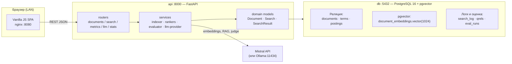

# ARCHITECTURE — устройство системы

## 1. Общая схема



Три компонента поисковой системы из лабы (агент-сборщик, БД, поисковый
механизм) отображаются так: «агент» = сидер коллекции + приём документов
через UI/API; «БД» = PostgreSQL; «поисковый механизм» = api (ранкеры).

## 2. Docker-сервисы

| Сервис | Образ | Порт | Назначение |
|---|---|---|---|
| `web` | nginx:alpine | **8080** | Статика SPA, reverse-proxy `/api/*` → `api:8000` |
| `api` | python:3.12-slim (build) | **8000** | FastAPI, uvicorn |
| `db` | pgvector/pgvector:pg16 | **5433→5432** | БД (внешний порт 5433 — не конфликтовать с локальным Postgres) |
| `ollama` | ollama/ollama (profile `local`) | 11434 | Офлайн-фолбэк LLM |
| `pgadmin` | dpage/pgadmin4 (profile `demo`) | 5050 | Показ БД преподавателю |
| `smoke` | mcr.microsoft.com/playwright (profile `test`) | — | E2E-проверки UI |

Сеть `ips-net` (bridge). Сфера применения «локальная сеть»: все порты
публикуются на `0.0.0.0` — доступ с другого устройства LAN по IP хоста.

## 3. Пакеты backend (`backend/app/`)

```
app/
├── main.py            # FastAPI factory, lifespan: init_db + seed
├── config.py          # pydantic-settings, все env-переменные
├── db.py              # engine, SessionLocal, Base, get_db
├── models/            # SQLAlchemy ORM (8 таблиц) — см. DATABASE.md
├── domain/            # классы лабы:
│   ├── document.py    #   Document: add/delete, idf, weights, vector
│   ├── search.py      #   Search: ПОЗ, 5 стратегий, выдача
│   └── search_result.py  # SearchResult: document_id/title/snippet/rank/date
├── nlp/
│   └── preprocessing.py  # tokenize → stopwords → lemmatize
├── retrieval/
│   ├── boolean.py  ├── tfidf.py  ├── bm25.py  ├── dense.py  └── hybrid.py
├── llm/
│   ├── provider.py    # LlmProvider: expand/answer/judge
│   ├── mistral.py     ├── ollama.py     └── off.py (graceful 503)
├── metrics/
│   └── evaluator.py   # все метрики из METRICS.md, прогон по qrels
├── seed/
│   └── loader.py      # data/collection + data/qrels → БД, идемпотентно
└── routers/
    ├── documents.py  ├── search.py  ├── metrics.py
    ├── llm.py        ├── stats.py   └── history.py
```

Соответствие диаграммам лабы (PDF, рис. 1–3): `Document`, `Search`,
`SearchResult` — имена и поля сохранены дословно, Python-нейминг.

## 4. Потоки данных

### Индексация документа
```
text → tokenize → lemmatize → [lemmas]
  → terms (словарь D, doc_freq++)
  → postings (tf; idf по (1.5); weight по (1.6))
  → нормированный вектор документа (см. ALGORITHMS.md §2.3)
  → embedding (mistral-embed 1024) → document_embeddings
```
Повторное сохранение документа = переиндексация (delete + insert postings).

### Поиск (запрос пользователя)
```
query → preprocess → [lemma q1..qn] → ПОЗ
  фильтры: all_words_together, date range
  → выбранный ранкер (boolean|tfidf|bm25|dense|hybrid)
  → топ-K документов → SearchResult(title, snippet 300, highlight, rank, date)
  → запись в search_log
```

### Оценка качества
```
выбранная модель → прогон по всем qrels-запросам
  → per-query: P@k, AP, NDCG, RR …
  → агрегаты: MAP, avgP@5/10, avg R-prec, macro-P/R/F1, 11-point
  → eval_runs (jsonb) → таблицы/графики в UI
```

### LLM-потоки
- **expand-query**: query → 5–8 лемм-подсказок (чипы в поиске).
- **answer (RAG)**: топ-5 результатов поиска → контекст с нумерацией [1..5] →
  ответ ≤200 слов, цитаты только [n] по выданным документам.
- **judge (PRF)**: LLM оценивает 0–3 топ-10 результатов → временные qrels →
  BM25 переранжирует (pseudo-relevance feedback). Судейские оценки не пишутся
  в эталонные qrels.

## 5. Конфигурация (.env)

| Переменная | По умолчанию | Описание |
|---|---|---|
| `POSTGRES_USER` / `POSTGRES_PASSWORD` / `POSTGRES_DB` | ips / ips / ips | БД |
| `DATABASE_URL` | postgresql+psycopg://ips:ips@db:5432/ips | строка подключения |
| `LLM_PROVIDER` | `mistral` | mistral \| ollama \| off |
| `MISTRAL_API_KEY` | — | ключ (не коммитится!) |
| `MISTRAL_CHAT_MODEL` | `ministral-14b-2512` | проверено владельцем |
| `MISTRAL_EMBED_MODEL` | `mistral-embed` | 1024 dim |
| `OLLAMA_BASE_URL` | http://ollama:11434 | профиль local |
| `OLLAMA_CHAT_MODEL` | `qwen2.5:3b` | под 4 GB VRAM |
| `OLLAMA_EMBED_MODEL` | `nomic-embed-text` | 768 dim (colöнка vector(1024) — padding нулями, см. DECISIONS) |
| `SEARCH_TOP_K` | 10 | размер выдачи по умолчанию |
| `LOG_LEVEL` | INFO | уровень логов |

## 6. Деградация без LLM

LLM_PROVIDER=off или нет ключа → `/api/llm/*` возвращают `503` с текстом
«LLM недоступен, запустите с ключом Mistral или профилем local». Поиск,
метрики, CRUD, история — полностью работоспособны. Это же поведение — при
сетевой ошибке провайдера (timeout 20 c, 1 ретрай).

## 7. Безопасность

- Секреты только через `.env` (в `.gitignore`), `.env.example` без ключей.
- API без аутентификации (учебная ЛВС-система), но CORS закрыт (только
  origin nginx), запросы к БД — только через ORM, SQL-инъекции исключены.
- Логи не содержат текста ключей; query пользователя логируется как есть
  (это функция: история поиска).
