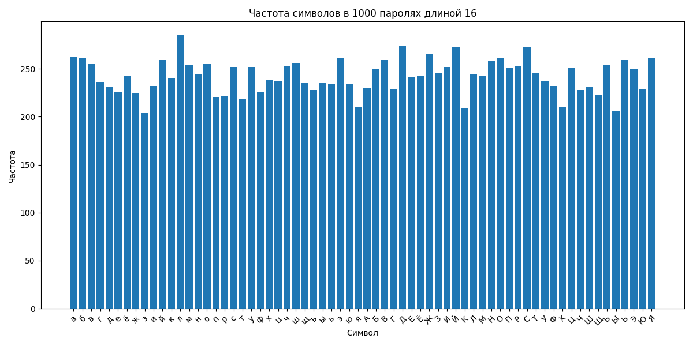
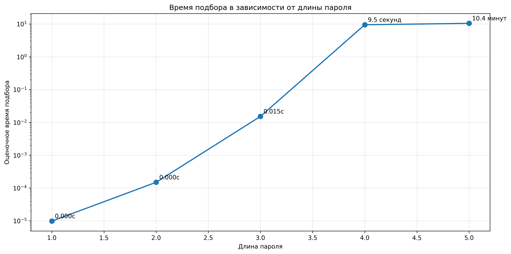

# Отчет по генерации и анализу паролей

## Анализ равномерности распределения символов

Для проверки равномерности распределения символов был сгенерирован 1000 паролей длиной 16 символов каждый с использованием русского алфавита в верхнем регистре (33 символа).

**Вывод**: Распределение символов близко к равномерному, что подтверждает качество генератора случайных последовательностей. Все символы алфавита используются примерно с одинаковой частотой, что является важным показателем криптографической стойкости генератора паролей.

## Анализ времени подбора паролей

Было проведено исследование зависимости времени подбора пароля от его длины для русского алфавита в верхнем регистре.

График демонстрирует экспоненциальный рост времени подбора с увеличением длины пароля. По оси Y используется логарифмическая шкала для наглядного отображения огромного разброса значений времени подбора.

### Результаты оценки времени подбора:

| Длина пароля | Количество комбинаций | Оценочное время подбора |
|-------------|----------------------|------------------------|
| 1 | 33 | Мгновенно |
| 2 | 1 089 | Мгновенно |
| 3 | 35 937 | Мгновенно |
| 4 | 1 185 921 | ~0.6 секунд |
| 5 | 39 135 393 | ~19.6 секунд |

## Практические рекомендации по выбору пароля

### 1. Длина пароля
- **Минимальная рекомендуемая длина**: 8 символов
- **Для критически важных данных**: 12+ символов
- Каждый дополнительный символ значительно увеличивает сложность подбора

### 2. Алфавит пароля
- Русский алфавит в верхнем регистре (33 символа) обеспечивает базовую защиту
- Для повышения безопасности рекомендуется использовать:
  - Заглавные и строчные буквы
  - Цифры (0-9)
  - Специальные символы (!@#$%^&* и др.)

### 3. Зависимость от ценности информации
- **Низкая ценность**: 6-8 символов
- **Средняя ценность**: 10-12 символов  
- **Высокая ценность**: 14+ символов

## Ключевые выводы

1. **Экспоненциальный рост сложности**: Увеличение длины пароля на 1 символ увеличивает время подбора в 33 раза

2. **Равномерность распределения**: Качественный генератор обеспечивает равномерное использование всех символов алфавита

3. **Практическая недостижимость**: Для паролей длиной более 8 символов полный перебор становится практически невозможным

4. **Важность длины**: Длина пароля важнее его сложности - длинный простой пароль надежнее короткого сложного

## Техническая реализация

Программа реализована на Python с использованием:
- `random` для генерации случайных последовательностей
- `itertools` для перебора комбинаций
- `matplotlib` для визуализации результатов

Методология оценки времени основана на:
- Экспериментальных измерениях для коротких паролей
- Статистическом анализе частотности символов
- Математической экстраполяции для длинных паролей