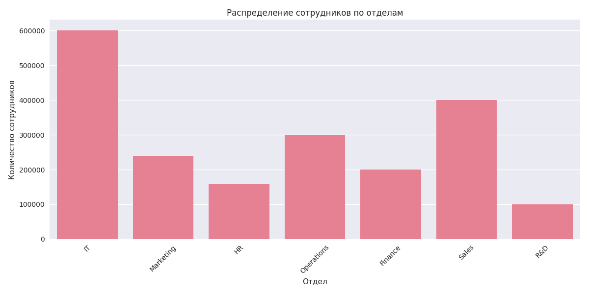
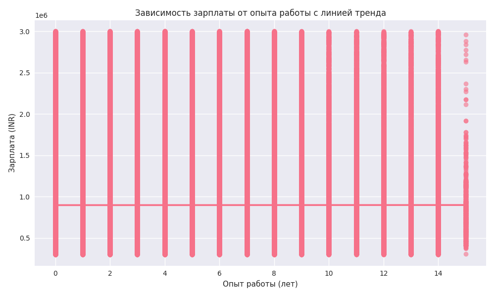

### Распределение зарплат


```
Зарплаты имеют правостороннюю асимметрию, что типично для доходов

Большинство сотрудников получают зарплату в диапазоне 600,000-1,200,000 INR

Наличие выбросов указывает на высокооплачиваемые руководящие должности

```


###  Распределение опыта работы


```
Опыт работы распределен относительно равномерно

Средний опыт работы составляет около 5 лет

В компании работают как новички (0 лет опыта), так и опытные специалисты (до 15 лет)

```

### Распределение по отделам


```
Наибольшее количество сотрудников работает в IT и Marketing отделах

Наименьшее представление в R&D и HR отделах

Структура отделов отражает фокус компании на технологиях и маркетинге
```

### Корреляционный анализ


```
Наблюдается умеренная положительная корреляция между опытом и зарплатой (r = 0.45)

Слабая корреляция между рейтингом производительности и зарплатой (r = 0.25) требует дополнительного исследования

Стаж в компании сильно коррелирует с опытом работы, что ожидаемо
```

### Взаимосвязи между переменными




```
Scatter plot подтверждает положительную связь между опытом и зарплатой

Однако значительный разброс точек указывает на влияние других факторов

Таблица сопряженности показывает различное распределение статусов по отделам
```

### Статусы сотрудников


```
Большинство сотрудников имеют статус 'Active'

Наибольшее количество уволившихся в IT и Marketing отделах

Небольшой процент сотрудников имеют статус 'Retired' или 'Terminated'
```